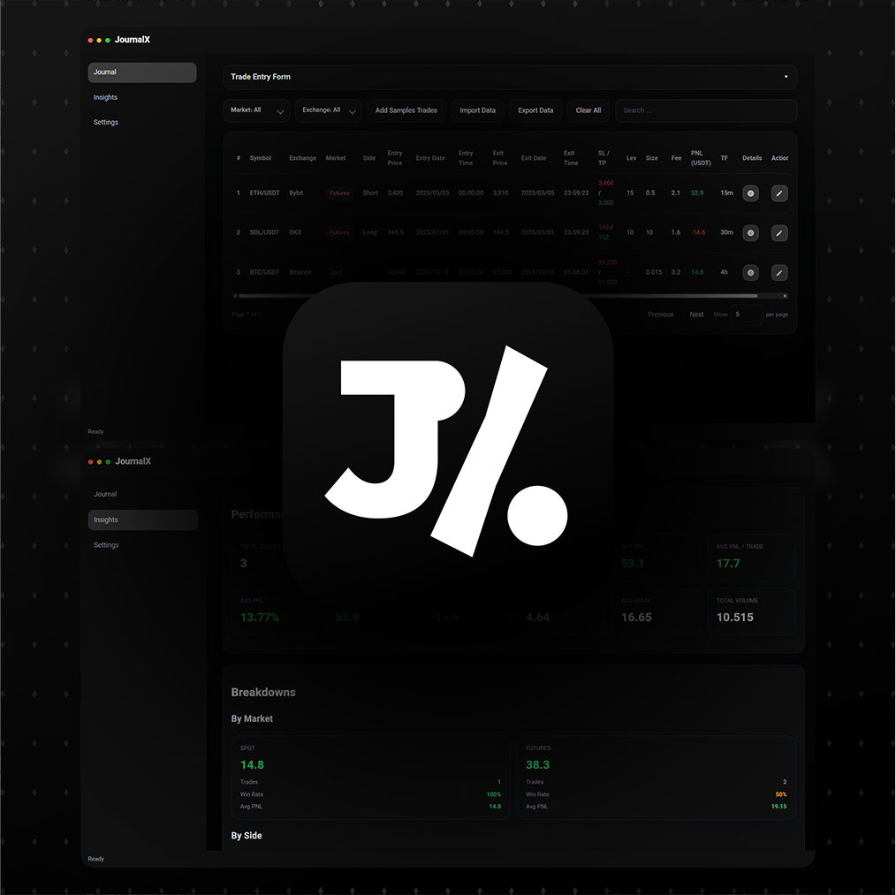

## **JournalX - Every Trade Tells A Story**
Every Trade Is More Than Just Numbers — It’s A Reflection Of Your Mindset, Discipline, And Growth. Behind Every Entry Lies A Decision, And Behind Every Exit, A Lesson. Sometimes You Win, Sometimes You Learn — But You Never Walk Away Empty-Handed. When You Record Everything, Your Mistakes Become Your Weapons, And Step By Step, You Evolve Into A Stronger Trader. JournalX Is By Your Side — Turning Every Trade Into Part Of Your Story Of Growth ...

---

## 📑 Table Of Contents
- [Launch JournalX](https://theakorg.github.io/journalx)
- [Features](#-features)
- [Installation](#%EF%B8%8F-installation)
- [Usage](#-usage)
- [License](#-license)

---

## 🚀 Features

- **Bilingual UI (English & Persian)** – Instant Language Toggle Plus Digit Style Options
- **Offline Access** – Works After The First Load; Your Data Stays Local
- **Flexible PNL Display** – Switch Between USDT And Percent
- **Trade Entry Form** – Log Spot Or Futures With Entry/Exit, Time, Size, Side (Futures), Leverage, SL/TP, Fees, Strategy, Emotion, Notes
- **Smart Field Logic** – Shows Only Relevant Fields (E.g., Hides Side/Leverage In Spot)
- **Editable Journal Table** – Review, Edit, Or Delete Trades; Columns For SL/TP, Leverage, Size, Fees, TF, PNL
- **Filters & Search** – Filter By Market/Exchange And Quick Search
- **Excel Import/Export** – Import From Exchanges (e.g., Binance, Bybit) And Export Anytime
- **Insights Dashboard** – KPIs, Win Rate, Net PNL, Avg PNL/Trade, Best/Worst, Profit Factor, Avg Hold, Total Volume
- **Breakdowns & Trends** – By Market (Spot/Futures), By Side (Long/Short), Top Exchanges, PNL Over Time, Monthly Performance
- **Dark UI** – Clean, Focused, Night-Friendly

---

---

## ⚙️ Installation

### Option 1 — Launch The Web App
- Open: https://theakorg.github.io/journalx

### Option 2 — Run Locally
1. Download Or Clone This Repository
2. Open `index.html` In A Modern Browser **or** serve the folder:
   - **Python**: `python -m http.server 8000`
   - **Node.js**: `npx serve .`
3. Visit `http://localhost:8000`

---

## 🧭 Usage

> [!IMPORTANT]
> **Desktop Only — On Purpose;** JournalX Is Built For Focused, High-Fidelity Journaling On A Laptop/Desktop. Mobile Entry Often Becomes Rushed And Emotion-Driven. If You’re Away From The Desk, Jot A Quick Note Elsewhere And Log It Properly On Desktop Later

> [!NOTE]
> **JournalX Is A Client-Side Web App — No Server Or Database Required**

> [!TIP]
> **Install As Web App (Optional):** Desktop (Chrome/Edge): Click The Install Icon In The Address Bar

---

## 📜 License
MIT License – Feel Free To Modify And Share
